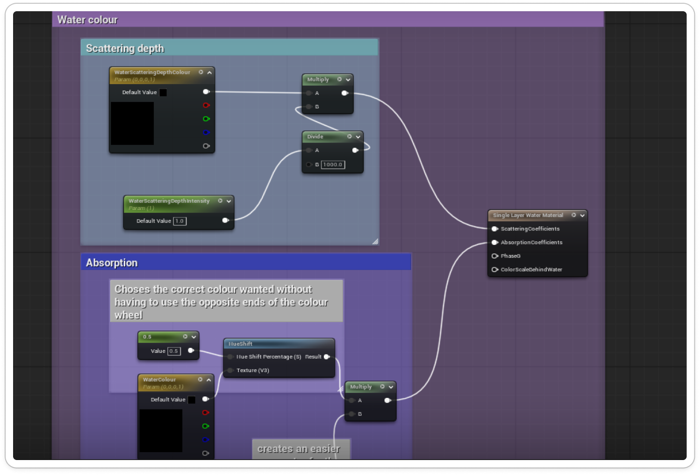
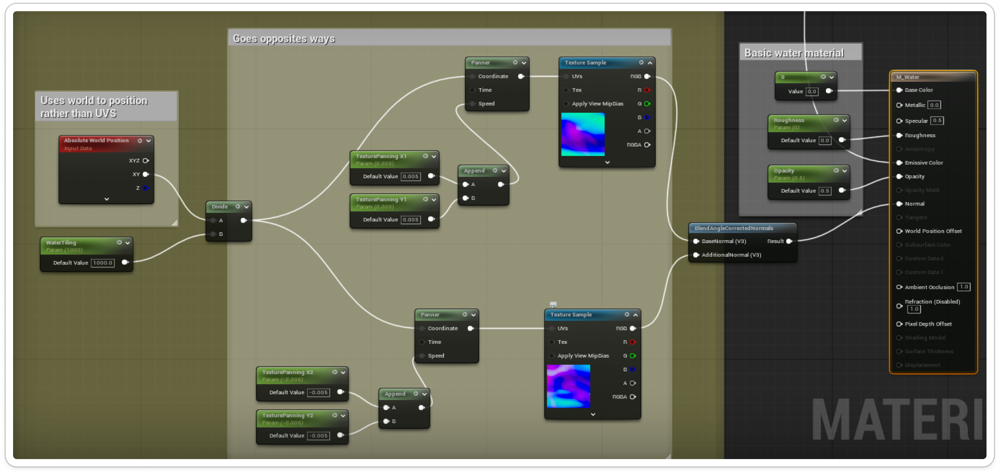
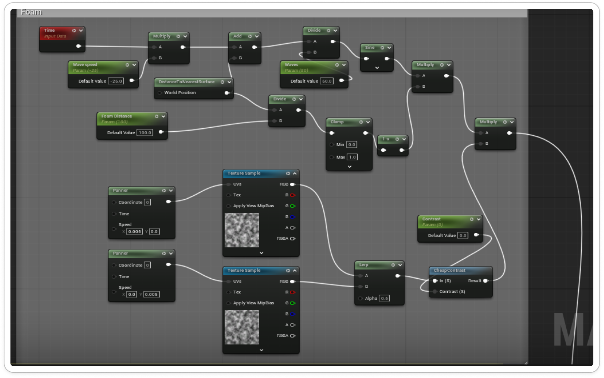
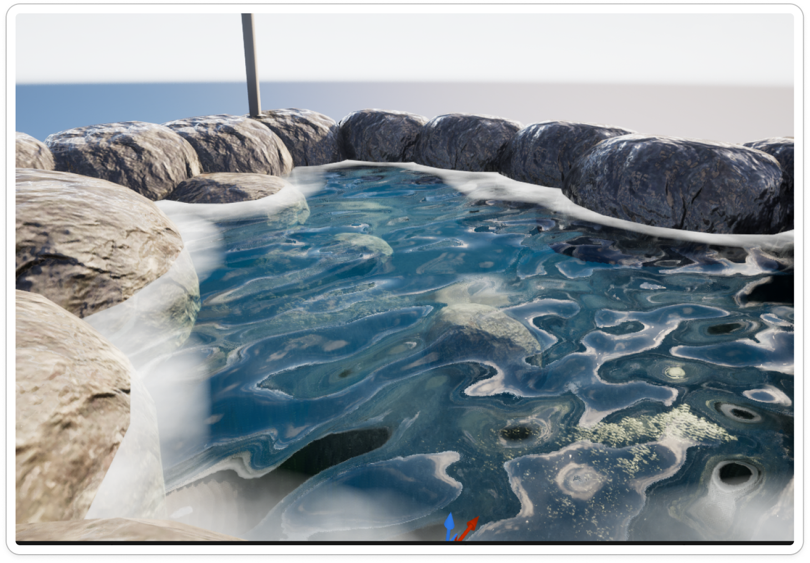
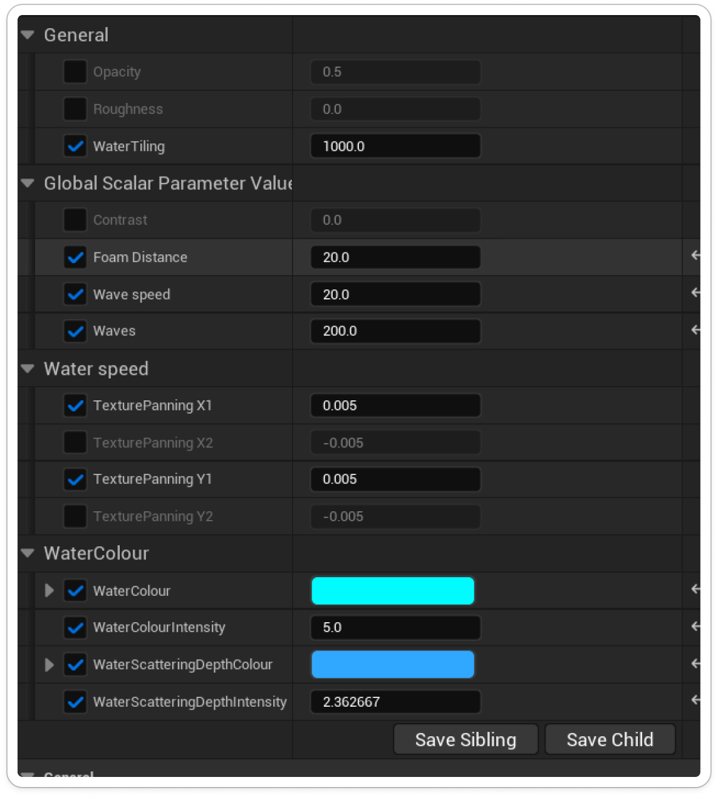
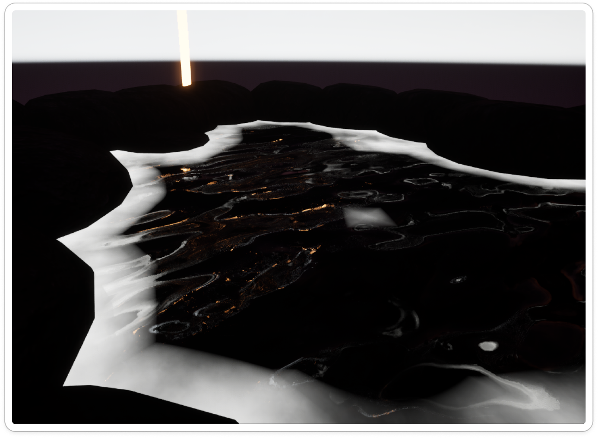

# ShaderProject
 
 ### 1. Stylized Water Material with World Position Offset  
**Technical Requirements:**  
- Implement **World Position Offset (WPO)** to create animated wave motion
- Use time-based animation for continuous wave movement
- Include parameters for wave height, speed, and frequency
- Add visual elements: foam, depth fade, refraction, or transparency
- Demonstrate vertex animation without skeletal meshes

For this material, I started with creating the parameters for the water colour and the depth. This was so I could make the water a realistic colour and adjust the parameters of the colour being darker as depth was added to the material using a scattering depth parameter. 

I then added WPO to the normal map of the water texture to be able to animate the wave movement and control the parameters for how fast/slow I wanted the waves to move.

 I then added in the foam to appear around the edges of the water when it touched the rocks surrounding it. This gives it more realism and emphasises the effects of the waves. 
 

 *End result*

 
 

**Guiding Questions:**
- How does WPO affect performance compared to animated meshes?

World Position Offset (WPO) runs in the vertex stage every frame. This is good for when simple maths is used i.e fewer waves and meshes arent really dense.  However, it becomes heavy when you stack wave octaves or use high density meshes. WPO is better to use for large bodies of water which is what I have used in my project since I’ve made a pool of water rather than adding in waterfalls. This makes the performance a lot cheaper and more flexible compared to animated meshes.  Animated meshes include skeletal and Vertex animation textures (VAT). Skeletal involves a high CPU and skinning cost and is more suitable for waterfalls/ smaller bodies of water. VAT reads baked motion on GPU and has a stable cost but adds texture bandwidth.These are usually used for materials which require more complex motions as they can be cleaner and more advanced than WPO. 

- How can you control wave direction and intensity?

I controlled wave direction and intensity by adding parameters to my material instance of the water material. I chose to add water tiling which when controlled it adjusts how stretched the material is to give a more controlled ripple effect of the normal material. Adjusting this changes how the ripples will look. I added wave speed to control how fast it moved, the faster the speed the more choppy look the waves give and I also added a parameter to adjust the intensity of them so they could appear more relaxed if needed. I added texture panning for both the x and y values so that the material would move both forward and backwards rather than just in one direction to make it look more realistic and have a better flow. 

- How does your water material respond to different lighting conditions?

When the directional light is adjusted using the time of day cycle I have made in my MPC, the water has highlights added on the waves where the light hits it during the dark and the foam still appears as white as well. The colour of the water goes really dark but when the light is set to during the day it goes back to normal as expected. 

### 2. Material Parameter Collection (MPC) System  
**Technical Requirements:**  
- Create an MPC with at least **4 parameters** that control a global scene effect
- Implement the MPC in **at least 2 different materials**
- Create a Blueprint that modifies MPC values at runtime
- Demonstrate a cohesive environmental effect (e.g., time of day, weather system, global color grading)

I implemented a Material Parameter Collection to dynamically control environmental changes based on the time of day. The collection includes parameters for time of day, lamp tint, sunlight tint, and rain intensity, allowing multiple materials to react in sync. The time of day parameter ranges from 0 to 1, smoothly transitioning the scene from day to night while influencing the other parameters. As night falls, the lamps shift from a soft pink hue to a glowing blue, increasing their emissive intensity to simulate artificial lighting in the dark. Meanwhile, the sky transitions from a warm pink to a deep purple, creating a natural dusk effect. Additionally, the rock materials gain a subtle shine at night, using increased roughness and reflection to mimic dew forming on their surfaces. This setup creates a cohesive and immersive atmosphere that visually communicates the passage of time and changing environmental conditions.

**Guiding Questions:**
- Why use MPC instead of individual material parameters?

Using a Material Parameter Collection (MPC) instead of individual material parameters allowed me to efficiently synchronize visual changes across multiple materials and lighting elements in my scene.If I had relied on individual material parameters, I would have had to manually update each material or use multiple blueprints to coordinate these effects, making the process more complex and less consistent. The MPC made it possible to achieve smooth, cohesive transitions across the environment with one central controller, improving both performance and workflow efficiency.

- How does your system maintain visual consistency across materials?

My system maintains visual consistency across materials by using a Material Parameter Collection (MPC) to drive all environmental changes from a single, unified set of parameters.Since they all use the same set of parameters, the lighting, color palette, and material reactions remain perfectly synchronized. This centralized control ensures that the environment changes feel cohesive and natural, maintaining a consistent visual tone throughout the scene.

### 3. Dynamic Material Instance with Runtime Control  
**Technical Requirements:**  
- Create a material with **at least 3 exposed parameters** (scalar and/or vector)
- Implement a **Dynamic Material Instance (DMI)** in Blueprint
- Create interactive controls to modify parameters during gameplay
- Demonstrate a practical use case (e.g., damage effect, dissolve, customization, hit feedback)

I implemented a Dynamic Material Instance (DMI) to allow real-time adjustments to various material properties through user input. The DMI controls three key parameters: Water Tint, Opacity Level, and Glow Intensity. I set up input bindings so that pressing the 1 key changes the water’s tint to pink using a Vector Parameter, while pressing 2 modifies the Scalar Parameter controlling a ball’s opacity, making it visible in the scene. Pressing 3 adjusts another Scalar Parameter to increase the ball’s glow intensity, giving it an emissive effect. The DMI is linked directly to the corresponding materials in the level, enabling each parameter change to update instantly during gameplay. This setup demonstrates how DMIs can provide flexible, interactive control over material behaviors without the need to recompile shaders or duplicate materials, streamlining both testing and visual experimentation.

**Guiding Questions:**
- When should you use DMI versus Material Instance Constant?

In my project, I used a Dynamic Material Instance (DMI) because I needed materials that could change in real time based on player input. These interactions required the material properties to update instantly during gameplay, which is exactly what DMIs are designed for. In contrast, a Material Instance Constant (MIC) is better suited for static or pre-defined variations—values that are set in the editor and remain fixed during runtime. If I had used MICs, I would have had to create separate instances for each visual variation and could not modify them interactively without rebuilding. By using DMIs, I was able to achieve smooth, real-time visual feedback while maintaining a single, flexible material setup, making them ideal for any system that needs dynamic responsiveness.

- How do you optimize DMI creation and updates?

I optimized Dynamic Material Instance (DMI) creation and updates by carefully managing when and how they were generated and modified during gameplay. Rather than creating new DMIs every time a key was pressed, I created them once at the start of the level and stored references to reuse throughout runtime. This allowed me to efficiently update parameters—like the water tint, ball opacity, and glow intensity—without the overhead of repeatedly instantiating materials. For example, when the player pressed keys 1, 2, or 3, I simply updated the existing DMI’s vector or scalar parameters to change the tint, opacity, or emissive glow instantly. Keeping the DMI linked directly to the materials in the scene also ensured minimal performance cost while maintaining responsiveness. This approach reduces unnecessary memory usage and improves frame stability, making it a best practice for optimizing DMI performance in real-time environments. 

